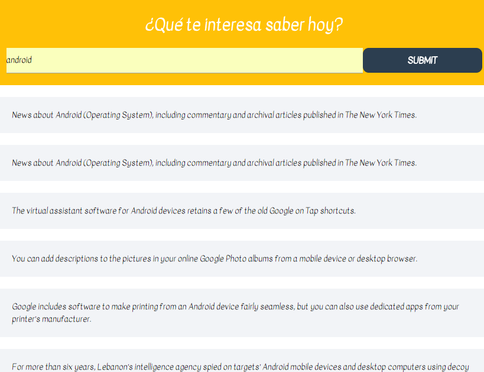

# Proyecto XHR-DEMO-FETCH

## Objetivos

Poner en practica el uso de AJAX, esencialmente haciendo uso de XMLHttpRequest, reemplazando este objeto por fetch.

## Herramientas Utilizadas

    - HTML5
    - CSS3
    - Materialize
    - JS
    - AJAX
    - FETCH

## Resultados

 
